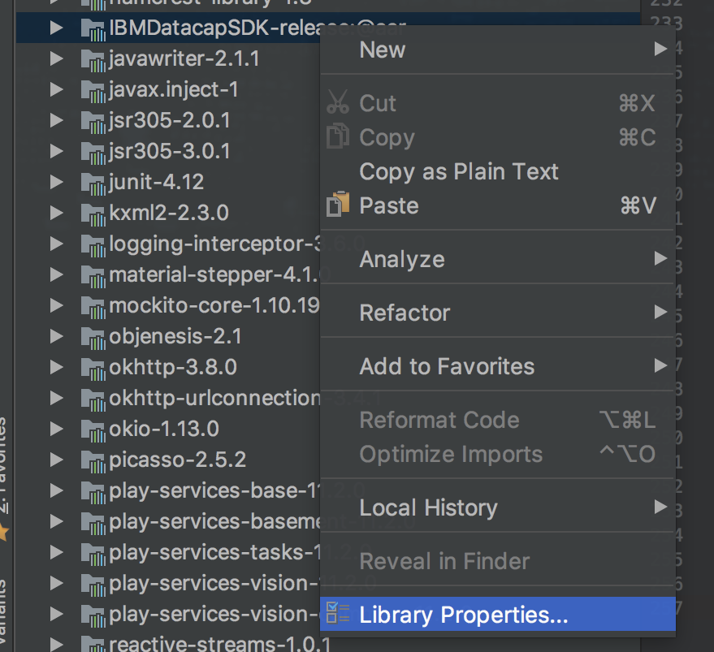
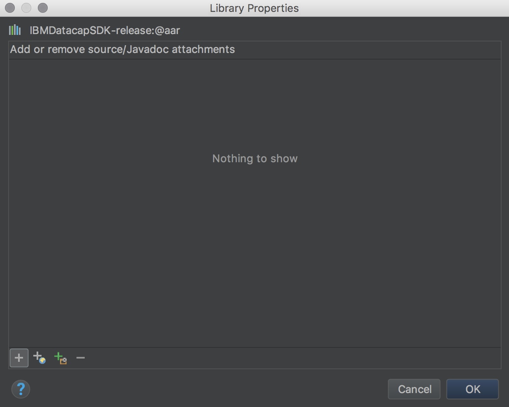

# Harbour Boulevard Datacap Samples

This is a repository containing 2 simple apps that demo the use of the **IBM Datacap SDK**.

## Autocapture sample

This is a simple app that allows users to capture images of documents (either manually or relying on the Datacap edge detection algorithms).

After an image is captured, you can manually adjust the corners of the document and correct the perspective.

The last step is to upload a batch.

## Harbour Boulevard sample

This is a slighlty more complex application where the user can go through the flow of opening an account.

The app will guide the user to capture required documents, extract information from those documents and finally upload the content to the Datacap servers.

## Adding the javadoc
It is highly recommended to add the SDK javadoc to your development environment because it makes it
a lot easier to understand what methods do and what parameters they need.

Here are the steps required to attach the javadoc in Android Studio :

- Switch view to `Project`
- expand *External Libraries* section and scroll down to the SDK entry (*IMBDatacapSDK-release@aar*)
- right click the entry and select *Properties*
 

- click the "**+**" button from the bottom left of the dialog
 

- browse to the location of the javadoc jar
-  select the jar then press *OK*
-  press OK to close the *Library Properties* dialog
- sync the project

## IBM Datacap SDK info

The SDK contains multiple components to help you achieve different tasks.

### DatacapApi
This component handles all the network communication with the server. It is used to:

- authenticate users
- download configurations
- upload batches
- also used by `DatacapTransactionProcessor `

| Method        | Description           |
| ------------- |:-------------|
| `login()`      | Authenticate a user on the connected server |
| `getDatacapApplications()`      | Get list of applications available on the connected server |
| `getWorkflows()`      | Get a list of *Workflows* for the selected application      |
| `getJobs()` | Get a list of jobs available for the given application and workflow index.      |
| `getDcoList()` | Get a list of available DCOs for the given application     |
| `getBatchConfiguration()`  |  Download the Batch setup  document for the given application and DCO      |
| `uploadBatch()`  | Upload a batch to the server      |
| `authenticateBox()`  | Authenticate using Box    |
| `getBoxRootFolderContents()`  | Get the contents of the root folder      |
| `getBoxFolderContents()`  | TGet the content of a Box folder with the given id      |
| `downloadBoxFile()`  | Download a file from Box      |

**Note:** Methods not listed in the above table are used internally by other
components and should not be used directly!

### DatacapBarcodeProcessor

This is a class that allows users to read and extract data from barcodes.

Supported barcode types :

- Interleaved 2 of 5
- Code 39
- Code 39 Extended
- Code 93
- Code 93 Extended
- Code 128
- EAN 13
- EAN 8
- UPC-A
- UPC-E
- PDF 417
- Data Matrix
- QR code
- Aztec

| Method        | Description           |
| ------------- |:-------------|
| `getBarcodesFromImage()`      |  Read a *DatacapBarcode* from an image.|
| `parseBitmask()`      |  Extract the list of supported barcode types from a bit mask.|

### DatacapZoneProcessor

This is a class that allows users to read and extract data from documents
 based on field configuration received from the server. This is a
 component that determines the field value position in the captured
 document and uses OCR to extract the value.

| Method        | Description           |
| ------------- |:-------------|
| `initDefaultInstance()`      |   Initialise a default instance of the *CaptureOcrProcessor* using *OcrLanguage.ENGLISH* as the ocr language|
| `initLanguageInstance()`      |  Initialise the *CaptureOcrProcessor* with the given training data archive and OcrLanguage |
| `processImage()`      |  Extract text from the given image |
| `processPage()`      |  Automatically extract the field values from a Page using template zones |
| `isProcessorReady()`      |  Check if the OCR processor is ready to process frames |
| `destroy()`      |  Release  *DatacapZoneProcessor* resources |

 **Note:** Some methods have an additional signature that allows users to specify an *`IConfguration`*
 object that can tune the image operations applied before running OCR.

 **Note:** Internally uses *`DatacapImageProcessor`*

### DatacapIdProcessor

This is a class that allows users to read and extract data from ID documents.

Supported ID types are defined in `DatacapId` class:

- MRZ2
- MRZ3
- US Driving License

| Method        | Description           |
| ------------- |:-------------|
| `initialize()`      |   Initialise components required by *DatacapIdProcessor*|
| `processIDImage()`      |  Extract ID information from an image based on the provided ID type |
| `processIDPage()`      |  Extract ID information from a *Page*, ID type extracted from page proeprties |
| `processPage()`      |  Automatically extract the field values from a Page using template zones |
| `processPassportImage()`      |  Extract information corresponding to *MRZ2/MRZ3* documents from an image |
| `processPassportPage()`      |  Extract information corresponding to *MRZ2/MRZ3* documents from a *Page* |

The DatacapIdProcessor is able to determine the ID type from the `IPage` object by calling
`DatacapIdHelper.getIdTypeForPage(idType, idSubtype, idCountry)`. The parameters for the helper method are
defined as properties in the `IPage`(*id_type*, *id_subtype*, *id_nation*).

Alternatively you can call `processIDImage`and send the Bitmap and a valid ID type.

**Note:** This component need to be initialised (call `initialize()`) before use!

**Note:** This component internally uses *`DatacapImageProcessor`*, *`DatacapZoneProcessor`*,
and *`DatacapBarcodeProcessor`* to extract information from ID documents.

### DatacapTransactionProcessor

This component is used to extract information from cheques.

| Method        | Description           |
| ------------- |:-------------|
| `processChequePage()`      |  Extract cheque information from an *IPage* |

**Note:** A `DatacapApi` needs to be correctly instantiated and passed
as a parameter to this component's constructor before you can use
the processing methods.

The component will automatically create all the required data for processing the cheque transaction.

### DatcapImageProcessor

This component allows users to apply automatic perspective correction
on an image or,  apply perspective correction using a defined array of document corners.

| Method        | Description           |
| ------------- |:-------------|
| `initialize()`      |  Initialize the image processing module |
| `isInitialized()`|  Check if the image processing module is initialized. |
| `applyAutomaticPerspectiveCorrection()`| Determines document corners and then applies perspective correction using a tolerance to  improve accuracy. |
| `applyPerspectiveCorrection()`| Applies perspective correction using the given document corners. No tolerance will be used when applying the correction because we assume a greater point precision. |

**Note:** This component need to be initialised (call `initialize()`) before use!

### DatacapCameraView

This is a custom view that provides camera preview and auto or guided capture functionality. The view can also display an indicator when document
scanning is running. At the moment, the visibility of this indicator can be configured only from `xml` via the `ds_dcv_show_indicator` attribute.

| Attributes        | Description           |
| ------------- |:-------------|
| `ds_dcv_edge_color`      | Choose the color used to draw the edges of the document - available only in auto capture mode |
| `ds_dcv_overlay_color`      |  Choose the color used to draw  over the document - alpha is applied internally,available only in auto capture mode     |
| `ds_dcv_guide_color` |  Choose the color used to draw the contour of the document - available only in guided capture mode     |
| `ds_dcv_show_indicator` |  Flag that indicates if the view should display an indicator when document scanning is active     |

Before you can  start the camera preview you need to add some configuration like:

- camera orientation
- flash options
- document aspect ratio
- document aspect ratio tolerance
- document size tolerance
- flag to use black & white preview

| Method        | Description           |
| ------------- |:-------------|
| `startCamera()`|  Obtain an *android.hardware.camera2.CameraDevice* based on the specified configuration options and start camera preview  |
| `stopCamera()`| Stop camera previews, automatic detection and release the *android.hardware.camera2.CameraDevice* |
| `isStarted()`|  Check if camera preview is started |
| `isDetecting()`|  Check if *DatacapCameraView* is automatically searching for document edges |
| `setCameraStateCallback()`|  Add a callback to be notified on camera device state( receive open/close events).|
| `startDetection()`|  Start processing images from preview in order to detect documents.|
| `stopDetection()`| Stop processing images. |
| `takePhoto()`|  Capture a still image trying to use auto-focus, auto-white-balance and auto-exposure(if not changed by user).|
| `setImageProcessingConfiguration()`|  Set the configuration to be used when processing images.|
| `setDocumentAspectRatio()`|  Set the aspect ratio required for the detection result.|
| `setAspectRatioTolerance()`|  Set the tolerance to be used when comparing document aspect ratios.|
| `setMinimumDetectionMargin()`|   Set the minimum margin required between the detection result and the screen boundaries.|
| `setDetectionAreaTolerance()`|  When using a view that shows an ID guide, this parameter will define how much smaller than the ID outline the detection result must be.|
| `setAccelerationThreshold()`|   Set the maximum amount of movement allowed before considering an image not fit for detecting documents.|
| `setSmallestAreaPercentage()`|   Set the minimum area percentage (elative to the screen area )that the detected document must have in order to be considered valid.|
| `setBlackAndWhiteFilterEnabled()`|  Set wether to use the Black & White filter or not.|
| `isFlashEnabled()`|  Check if the camera flash is enabled.|
| `setAutoCaptureDelay()`|   Set the minimum time that must pass between consecutive captures triggered by edge detection. Default value is 3 seconds.|
| `setPageType()`|  Set the page type we want to detect for. This will automatically choose the  *IConfiguration* required for image processing.|
| `setCameraFacing()`|  Choose the orientation of the camera device you want to use.|
| `setFlashMode()`| Choose the camera flash mode from available options defined in *DatacapCameraView.FlashMode*.|
| `setIdFormat()`| Set a valid *DatacapId.DatacapIdType* to show the ID outline over the camera preview. |
| `setDatacapDetectionListener()`| Register a callback for receiving ID processing results. |

#### Camera State
You can register a **CameraView.CameraStateCallback** by calling `setCameraStateCallback` on the DatacapCameraView instance. This callback will notify you when the camera hardware state chenges (open/close).

#### Detection

In order to use the auto-capture feature you need to register a `DocumentDetectionListener` and call `startDetection()` after the camera is succesfully opened.

The result of detection will be delivered in an `AutocaptureResult` object which contains the following information:

- the original image (as captured by the device)
- the deskewed image (image cropped and perspective-corrected using the detected document corners)
- an array containing the detected document corners
- the original image resolution

**Note:** Maximum camera preview resolution is 1920x1080 - as per Android Documentation

**Note:** Maximum auto-capture resolution is capped at 1920x1080 due to Android limitations,

#### Overlay

*DatacapCameraView* can be configured to behave differently based on the type of document you
need to capture.

You can call `DatcapCameraView#seetIdType()` with a valid Id type defined in `DatacapId` or,
you can call  `DatcapCameraView#setPageType()` passing in the `IPageType` that describers the document you want to capture.

**Limitations**
- default behaviour is to do a free form edge detection -> the document will be outlined in the preview
- for back of Driving licenses and passports there is a mode, guided capture, which will draw the outline  of the document on the
preview(document needs to be inside of the drawn outline in order to trigger autocapture )

### DocumentCornerPickerView && DocumentFixedCornerPickerView

These components allow users to manually select document corners. You can set initial corners position by calling `setInitialCornerPosition()`.

The corners are automatically updated based on user interaction, to retrieve them you have to call `getSelectedCorners()`.

The difference between *DocumentCornerPicker* and *DocumentFixedCornerPicker* is that *DocumentFixedCornerPicker* **enforces a rectangular shape selection**. This is not ideal when trying to apply perspective correction but it provides better interaction when selecting portions of a document(for applying OCR for example).

#### DocumentCornerPickerView

You can customize the *DocumentCornerPickerView* appearance using the provided attributes:

| Attributes        | Description           |
| ------------- |:-------------|
| `dcpv_cornerRadius`      | Control the radius of the circle drawn in the document corner |
| `dcpv_cornerColor`      | Choose the color for the circle drawn in the document corner      |
| `dcpv_lineWidth` | The thickness of the lines drawn between the document corners      |
| `dcpv_lineColor` | The color of the lines drawn between the document corners      |
| `dcpv_maskColor`  | The color of the selection mask      |
| `dcpv_maskAlpha`  | The opacity of the selection mask      |
| `dcpv_maxCornerDistance`  | The maximum distance between a touch event and the coordinates of a document corner  so the corner is considered to be selected    |
| `dcpv_magnifierCrossHairSize`  | The width and height of the magnifier cross-hair lines      |
| `dcpv_magnifierCrossHairColor`  | The color of the magnifier cross-hair lines      |
| `dcpv_magnifierBorderWidth`  | The width of the border used to draw the magnifier      |

The view must receive the path of the image you want to deskew in `setImagePath()`. The image will
be automatically resized to fit in the available view space while maintaining the original image aspect ratio.

The method `setInitialCornerPosition()` must be called **AFTER**
setting the image path!
